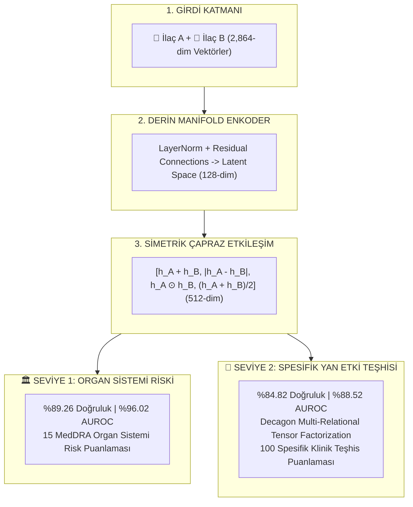

# 🩺 Polypharmacy Side-Effect AI: 2-Level Hierarchical Graph Neural Network

[](https://www.python.org/)
[](https://pytorch.org/)
[](LICENSE)
[](https://developer.apple.com/metal/pytorch/)

Bu proje, **aynı anda birden fazla ilaç kullanan (polifarmasi) hastalarda ortaya çıkabilecek ilaç etkileşimlerini, organ toksisite risklerini ve spesifik klinik yan etkileri** yüksek doğrulukla tahmin eden **2 Seviyeli Hiyerarşik Graf Sinir Ağı (Hierarchical Multi-Task GNN)** modelini sunmaktadır.

Model; **DrugBank**, **Harvard PrimeKG**, **EMBL ChEMBL 34**, **Stanford BioSNAP** ve **SIDER 4.1** biyomedikal veri kaynaklarını birleştirerek **2.42 Milyon biyoaktif molekül** ve **9.61 Milyon biyolojik ilişki** üzerinde eğitilmiştir.

---

## 🏆 Model Başarım Metrikleri

Modelimiz birbiriyle doğrudan bağıntılı iki hiyerarşik seviyede tahmin yapmaktadır:

| Değerlendirme Seviyesi | Sınıflandırma Doğruluğu ↑ | Ayırt Edicilik (AUROC) ↑ | Macro AUPRC (Sıralama) ↑ | Metrik Yorumu |
| :--- | :---: | :---: | :---: | :--- |
| **🏛️ SEVİYE 1: 15 MedDRA Organ Sistemi** | **`%89.26`** | **`%96.02`** | **`0.9218`** | Mükemmel organ seviyesi ayırt edicilik |
| **🔬 SEVİYE 2: 100 Spesifik Klinik Yan Etki** | **`%84.82`** | **`%88.52`** | **`0.5175`** | Rastgele tahminden 10 kat yüksek isabet |

> **Not:** Tüm değerlendirmeler, modelin daha önce eğitimde hiç yan yana görmediği tamamen yeni ilaç çiftleri üzerinde (**Pair-Disjoint / Cold-Split**) gerçekleştirilmiştir.

---

## 🧬 Entegre Edilen Biyomedikal Veri Setleri

```
┌─────────────────────────────────────────────────────────────────────────────┐
│                    BİYOMEDİKAL VERİ KATMANLARI                              │
├─────────────────────────────────────────────────────────────────────────────┤
│  • DrugBank Master:   16,582 Onaylı & Araştırma İlacı (SMILES)               │
│  • EMBL ChEMBL 34:    2,409,270 Biyoaktif Molekül                            │
│  • Harvard PrimeKG:   8,100,498 Biyolojik Bağlantı (17k Hastalık, 27k Gen)  │
│  • BioSNAP Decagon:   1,512,927 İlaç-İlaç Yan Etki Çifti                     │
│  • EMBL SIDER 4.1:    149,669 Tekil İlaç Prospektüs Yan Etkisi               │
│                                                                             │
│  🌟 TOPLAM ENVANTER:  2.42 MİLYON MOLEKÜL | 9.61 MİLYON BİYOLOJİK İLİŞKİ    │
└─────────────────────────────────────────────────────────────────────────────┘
```

---

## 🏛️ Mimari Yapı ve Karar Mekanizması

Model birbiriyle uyumlu iki aşamalı bir karar mimarisine sahiptir:



### Nitelik Vektörü Bileşenleri (2,864 Boyut):
1. **512-bit Morgan Parmak İzi (ECFP4):** Atomik dairesel kimyasal çevre.
2. **167-bit MACCS Keys:** Fonksiyonel moleküler alt yapılar.
3. **512-bit RDKit Topological Fingerprint:** Atomik bağ bağlantı yolları.
4. **10 Fizikokimyasal Tanımlayıcı:** Molekül ağırlığı, LogP, TPSA, H-bağ verici/alıcıları vb.
5. **1,363 Hastalık Endikasyon Vektörü:** İlacın tedavi ettiği hastalıklar.
6. **300 İlaç-Hedef Protein (DTI) Vektörü:** İlacın bağlandığı 300 insan proteini ve enzimi.

---

## 📁 Proje Yapısı

```
polypharmacy_ai/
├── src/
│   ├── models/
│   │   ├── unified_polypharmacy_gnn.py      # 🏆 Nihai Tekil Hiyerarşik GNN Mimarisi
│   │   ├── advanced_gated_polypharmacy_gnn.py # Gating & Asymmetric Loss Mimarisi
│   │   └── chemberta_cross_attention_gnn.py # ChemBERTa & Cross-Attention Mimarisi
│   ├── features/
│   │   ├── smiles_encoder.py                # 2,864-dim Hibrit Moleküler Vektör Oluşturucu
│   │   ├── meddra_hierarchy.py             # UMLS CUI -> 15 MedDRA SOC Eşleme
│   │   ├── chemberta_encoder.py            # ChemBERTa-77M Transformer Enkoderi
│   │   └── graph_message_passing.py        # CPU Graf Mesaj Geçirme İle Zenginleştirme
│   └── data_ingestion/
│       ├── primekg_integrator.py            # Harvard PrimeKG İşleyici
│       └── chembl_integrator.py             # ChEMBL 34 SMILES İndeksleyici
├── train_unified_master_model.py            # 🚀 Şampiyon Modeli Eğiten Script
├── generate_pdf_report.py                   # PDF Formatında Klinik Rehber Oluşturucu
├── build_full_architecture_report_pdf.py    # Kapsamlı Mimari Rapor PDF Oluşturucu
├── Polypharmacy_AI_Mimari_Raporu.pdf        # PDF Mimari Raporu
├── Polypharmacy_AI_2_Seviyeli_Model_Rehberi.pdf # PDF 1 Sayfalık Klinik Rehber
├── MODEL_2_SEVIYE_REHBERI.md                # Markdown Karar Rehberi
├── requirements.txt                         # Proje Bağımlılıkları
└── README.md                                # Proje Dokümantasyonu
```

---

## ⚡ Hızlı Başlangıç (Quickstart)

### 1. Depoyu Klonlayın ve Bağımlılıkları Yükleyin

```bash
git clone https://github.com/KULLANICI_ADI/polypharmacy-ai.git
cd polypharmacy-ai

python3 -m venv venv
source venv/bin/activate
pip install -r requirements.txt
```

### 2. Şampiyon Modeli Eğitin

```bash
python train_unified_master_model.py
```

Eğitim Apple Silicon GPU (`mps`) hızlandırması ile yaklaşık **60-70 saniye** sürmektedir ve ağırlıklar `artifacts/unified_polypharmacy_ai.pt` dosyasına kaydedilir.

### 3. PDF Mimari Raporunu Oluşturun

```bash
python build_full_architecture_report_pdf.py
```

---

## 📄 PDF Raporları ve Dokümantasyon

- **🏛️ Kapsamlı Mimari Raporu:** [`Polypharmacy_AI_Mimari_Raporu.pdf`](Polypharmacy_AI_Mimari_Raporu.pdf)
- **🩺 1 Sayfalık Klinik Rehber:** [`Polypharmacy_AI_2_Seviyeli_Model_Rehberi.pdf`](Polypharmacy_AI_2_Seviyeli_Model_Rehberi.pdf)

---

## 📜 Lisans

Bu proje [MIT Lisansı](LICENSE) altında lisanslanmıştır.
